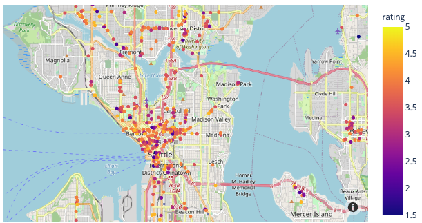

# data-enrichment-wk14-activity-mapping-yelp-api-results
 

## Obective

- For this CodeAlong, we will be working with the Yelp API. 
- You will use the the Yelp API to search your home town for a cuisine type of your choice.
- Next class, we will then use Plotly Express to create a map with the Mapbox API to visualize the results.
- Check out this Example MAP:
[](https://chart-studio.plotly.com/~dojopurvi/3/#/)]   
    

## Tools You Will Use
- Part 1:
    - Yelp API:
        - Getting Started: 
            - https://www.yelp.com/developers/documentation/v3/get_started

    - `YelpAPI` python package
        -  "YelpAPI": https://github.com/gfairchild/yelpapi
- Part 2:

    - Plotly Express: https://plotly.com/python/getting-started/
        - With Mapbox API: https://www.mapbox.com/
        - `px.scatter_mapbox` [Documentation](https://plotly.com/python/scattermapbox/): 


### Applying Code From
- Efficient API Calls Lesson Link: https://login.codingdojo.com/m/376/12529/88078


```python
# Standard Imports
import numpy as np
import pandas as pd
import matplotlib.pyplot as plt
import seaborn as sns

# Additional Imports
import os, json, math, time
from yelpapi import YelpAPI
from tqdm.notebook import tqdm_notebook
```

## 1. Registering for Required APIs


- Yelp: https://www.yelp.com/developers/documentation/v3/get_started


> Check the official API documentation to know what arguments we can search for: https://www.yelp.com/developers/documentation/v3/business_search

### Load Credentials and Create Yelp API Object


```python
# Load API Credentials

```


```python
# Instantiate YelpAPI Variable

```

### Define Search Terms and File Paths


```python
# set our API call parameters and filename before the first call

```


```python
## Specify fodler for saving data


# Specifying JSON_FILE filename (can include a folder)
JSON_FILE = None
```

### Check if Json File exists and Create it if it doesn't


```python
## Check if JSON_FILE exists

## If it does not exist: 
    
    ## CREATE ANY NEEDED FOLDERS
    # Get the Folder Name only

    
    ## If JSON_FILE included a folder:

        # create the folder

        
        
    ## INFORM USER AND SAVE EMPTY LIST

    
    
    ## save the first page of results

        
## If it exists, inform user

```

### Load JSON FIle and account for previous results


```python
## Load previous results and use len of results for offset

## set offset based on previous results

```

### Make the first API call to get the first page of data

- We will use this first result to check:
    - how many total results there are?
    - Where is the actual data we want to save?
    - how many results do we get at a time?


```python
# use our yelp_api variable's search_query method to perform our API call

```


```python
## How many results total?

```

- Where is the actual data we want to save?


```python

```


```python
## How many did we get the details for?
results_per_page = None
results_per_page
```

- Calculate how many pages of results needed to cover the total_results


```python
# Use math.ceil to round up for the total number of pages of results.

```


```python
for i in tqdm_notebook( range(1,n_pages+1)):
    ## The block of code we want to TRY to run
        
        
        ## Read in results in progress file and check the length

        
        ## save number of results for to use as offset
        
        
        
        ## use n_results as the OFFSET 
        

        ## append new results and save to file
        

            
    ## What to do if we get an error/exception.
        

```

## Open the Final JSON File with Pandas


```python
df = None
```


```python
## convert the filename to a .csv.gz
csv_file = JSON_FILE.replace('.json','.csv.gz')
csv_file
```


```python
## Save it as a compressed csv (to save space)

```

## Bonus: compare filesize with os module's `os.path.getsize`


```python
size_json = os.path.getsize(JSON_FILE)
size_csv_gz = os.path.getsize(JSON_FILE.replace('.json','.csv.gz'))

print(f'JSON FILE: {size_json:,} Bytes')
print(f'CSV.GZ FILE: {size_csv_gz:,} Bytes')

print(f'the csv.gz is {size_json/size_csv_gz} times smaller!')
```

## Next Class: Processing the Results and Mapping 
